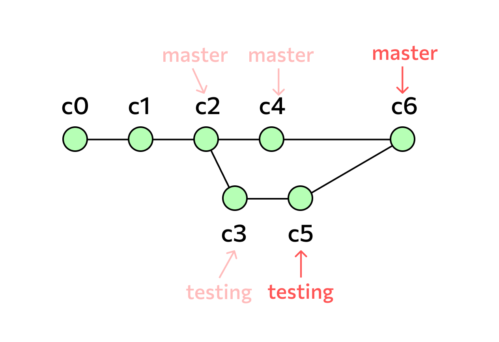
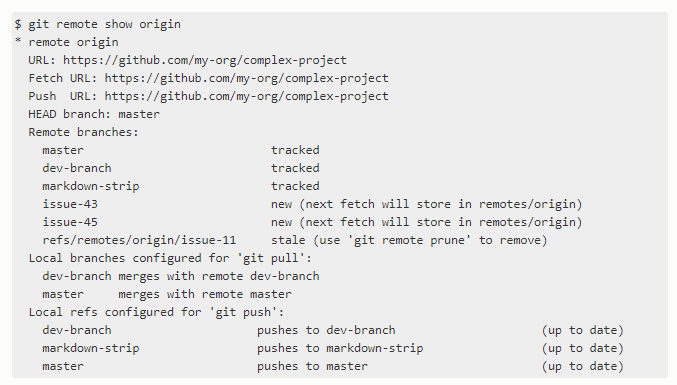

# Добрый день, уважаемые студенты! 
  При выполнении данной работы от вас требуется дополнить мой репозиторий, добавив в него свой файл с инструкцией по работе с git. Помните, что добавление файла - такой же процесс изменения репозитория, как и изменения внутри конкретных файлов и не пугайтесь этого :)

  P.S. Называйте добавляемые файлы своими фамилиями(только на английской раскладке), чтобы мне было проще их идентифицировать. И не забудьте сделать скрин окна с pullrequest, на сайт GB необходимо отослать именно этот скрин, чтобы работа была окончательно завершена.

  P.P.S. Не забывайте, что отправляем на pullrequest мы побочные ветки!

  # Git #

## Что такое Git и зачем он нужен? ##

Git - это консольная утилита, для отслеживания и ведения истории изменения файлов, в вашем проекте. Чаще всего его используют для кода, но можно и для других файлов. Например, для картинок - полезно для дизайнеров.

С помощью Git-a вы можете откатить свой проект до более старой версии, сравнивать, анализировать или сливать свои изменения в репозиторий.

Репозиторием называют хранилище вашего кода и историю его изменений. Git работает локально и все ваши репозитории хранятся в определенных папках на жестком диске.

Так же ваши репозитории можно хранить и в интернете. Обычно для этого используют три сервиса:

* GitHub

* Bitbucket

* GitLab

Каждая точка сохранения вашего проекта носит название коммит (commit). У каждого commit-a есть hash (уникальный id) и комментарий. Из таких commit-ов собирается ветка. Ветка - это история изменений. У каждой ветки есть свое название. Репозиторий может содержать в себе несколько веток, которые создаются из других веток или вливаются в них.

 ## Общая информация ## 
 
 Git (произносится «гит»[7]) — распределённая система управления версиями. Проект был создан Линусом Торвальдсом для управления разработкой ядра Linux, первая версия выпущена 7 апреля 2005 года. На сегодняшний день его поддерживает Джунио Хамано.

Среди проектов, использующих Git — ядро Linux, Swift, Android, Drupal, Cairo, GNU Core Utilities, Mesa, Wine, Chromium, Compiz Fusion, FlightGear, jQuery, PHP, NASM, MediaWiki, DokuWiki, Qt, ряд дистрибутивов Linux.

Программа является свободной и выпущена под лицензией GNU GPL версии 2. По умолчанию используется TCP порт 9418.
Разработано множество графических интерфейсов для системы, среди них — GitKraken (кроссплатформенный условно бесплатный клиент Git), SmartGit (кроссплатформенный интерфейс на Java), gitk (простая и быстрая программа, написана на Tcl/Tk, распространяемая с самим Git), Giggle (вариант на Gtk+), TortoiseGit (интерфейс, реализованный как расширение для проводника Windows), SourceTree (бесплатный Git-клиент для Windows и Mac), Github-клиент и ряд других.

Кроме того, разработано множество веб-фронтендов, в числе которых - GitWebAdmin, GitLab, Gitblit, Gerrit, Gitweb, Kallithea, Gitea.

### Что такое репозиторий Git? ###

Репозиторий — это все файлы, находящиеся под контролем версий, вместе с историей их изменения и другой служебной информацией.

Репозиторий Git можно создать, либо выбрав любую папку на компьютере, либо клонировав себе уже существующий репозиторий, например у работодателя.

### Где хранится репозиторий? ###
Существуют разные способы хранения и использования репозитория: выделяют локальные, централизованные и распределенные системы контроля версий.

В локальных системах контроля версий репозиторий хранится и используется на одном устройстве, но работать с такой системой может только один разработчик. В случае централизованной системы репозиторий хранится на одном сервере.

Лучше всего для большого количества разработчиков подходят распределенные системы контроля версий, к которым относится и Git. Такая система представляет собой облачное хранилище: каждый пользователь хранит на своем устройстве весь репозиторий целиком, и по мере изменения репозитории синхронизируются.

### Что такое коммит и коммитить? ###

о-английски commit значит «фиксировать». Git-коммит — это операция, которая берет все подготовленные изменения и отправляет их в репозиторий как единое целое.

Зачем нужен коммит, если Git и так следит за всеми изменениями? Коммиты разбивают процесс разработки, состоящий из большого количества правок, на отдельные шаги. То есть коммит — это некое логически завершенное изменение внутри проекта и понятная (в том числе и другим разработчикам) точка, к которой можно вернуться, если возникнут какие-то проблемы.

Изменения в рамках одного коммита подчиняются определенным, установленным командой разработчиков правилам и рекомендациям, касающимся именования, описания и содержания коммитов.

Как правило, рабочий процесс представляет собой цикл: коммит — изменение файлов — коммит.

### Что такое ветвление? ###

Удобная поддержка ветвления — важное свойство Git. Использование ветвления позволяет решать отдельные задачи, не вмешиваясь в основную линию разработки.

Ветка в Git — это последовательность коммитов. С технической точки зрения ветка — это указатель или ссылка на последний коммит в этой ветке. По умолчанию, имя основной ветки в Git — master. Каждый раз, когда создается новый коммит, указатель ветки master автоматически передвигается на него.

При создании новой ветки коммиту дается новый указатель, например testing. Если переключиться на ветку testing и сделать новый коммит, то указатель на ветку testing переместится вперед, тогда как указатель на основную ветку master останется на месте. Переключившись обратно на ветку master, файлы в рабочем каталоге вернутся в состояние коммита, на который указывает master.

В этом примере история проекта разошлась на две изолированные друг от друга версии, между которыми можно переключаться и при желании слить их в одну.

## Зачем нужен GitHub? ##

GitHub — это самый популярный сайт для хранения git-репозиториев и работы с ними. Также GitHub является крупнейшей площадкой для размещения проектов с открытым исходным кодом. Для просмотра и загрузки общедоступных репозиториев не требуется ни регистрации, ни оплаты аккаунта.

В каком-то смысле GitHub — это еще и социальная сеть для разработчиков. Зарегистрированные пользователи могут публиковать контент и управлять своими репозиториями, вносить вклад в чужие репозитории, вести обсуждения, просматривать изменения в коде, комментировать их и следить за обновлениями знакомых.

GitHub часто используют при рекрутменте — активный аккаунт и высокое качество кода могут сильно помочь в поиске работы. Поэтому особенно важно иметь аккаунт, чтобы показать свой код коллегам и как он эволюционирует со временем.

Сейчас существует и множество других онлайн-сервисов, интегрированных с Git. Альтернативы GitHub — это, например, GitLab и BitBucket. У обоих сайтов меньше аудитория, но у них есть свой функционал и свои преимущества, например BitBucket более удобен для небольших проектов с закрытым кодом.

## Взаимодействие с другими системами контроля версий ##

В стандартной поставке Git поддерживается взаимодействие с CVS (импорт и экспорт, эмуляция CVS-сервера) и Subversion (частичная поддержка импорта и экспорта). Стандартный инструмент импорта и экспорта внутри экосистемы — архивы серий версионированных файлов в форматах .tar.gz и .tar.bz2.

## Установка Git ##

Установить git на свою машину очень просто:

* Linux — нужно просто открыть терминал и установить приложение при помощи пакетного менеджера вашего дистрибутива. Для Ubuntu команда будет выглядеть следующим образом:

**sudo apt-get install git**

* Windows — мы рекомендуем git for windows, так как он содержит и клиент с графическим интерфейсом, и эмулятор bash.

* OS X — проще всего воспользоваться homebrew. После его установки запустите в терминале:

**brew install git**

## Настройка Git ## 

Итак, мы установили git, теперь нужно добавить немного настроек. Есть довольно много опций, с которыми можно играть, но мы настроим самые важные: наше имя пользователя и адрес электронной почты. Откройте терминал и запустите команды:

**git config --global user.name "My Name"**

**git config --global user.email myEmail@example.com**

Теперь каждое наше действие будет отмечено именем и почтой. Таким образом, пользователи всегда будут в курсе, кто отвечает за какие изменения — это вносит порядок.

Git хранит весь пакет конфигураций в файле .gitconfig, находящемся в вашем локальном каталоге. Чтобы сделать эти настройки глобальными, то есть применимыми ко всем проектам, необходимо добавить флаг –global. Если вы этого не сделаете, они будут распространяться только на текущий репозиторий.

Для того, чтобы посмотреть все настройки системы, используйте команду:

**git config --list**

Для удобства и легкости зрительного восприятия, некоторые группы команд в Гит можно выделить цветом, для этого нужно прописать в консоли:

**git config --global color.ui true**

**git config --global color.status auto**

**git config --global color.branch auto**

Если вы не до конца настроили систему для работы, в начале своего пути - не беда. Git всегда подскажет разработчику, если тот запутался, например:

1. Команда git --help - выводит общую документацию по git

2. Если введем git log --help - он предоставит нам документацию по какой-то определенной команде (в данном случае это - log)

3. Если вы вдруг сделали опечатку - система подскажет вам нужную команду

4. После выполнения любой команды - отчитается о том, что вы натворили

5. Также Гит прогнозирует дальнейшие варианты развития событий и всегда направит разработчика, не знающего, куда двигаться дальше

Тут стоит отметить, что подсказывать система будет на английском.

## Команды для работы с git ##

**git init** - Инициализация репозитория

**git status** - Проверка статуса репозитория

**git commit** - Внесение изменений в реппозиторий

**git log** - Просмотр истории коммитов с изменениями

**git show 1af17e** -  Просмотр заданного коммита (значение хеша уникально для каждого коммита, созданного в вашем репозитории.)

**git diff** - Просмотр изменений до коммита

**git commit --amend -m "Updated message for the previous commit"** -  Изменение последнего коммита 

**git branch**- Просмотр списка веток

**git branch -a** - Просмотр списка удалённых веток

**git remote show название реппозитория** - Получение дополнительных сведений об удалённом репозитории

**git add** - Добавляет содержимое рабочего каталога в индекс (staging area) для последующего коммита.

**git reset** - Используется в основном для отмены изменений

**git rm** - Используется в Git для удаления файлов из индекса и рабочей копии.

**git clean** - Используется для удаления мусора из рабочего каталога. Это могут быть результаты сборки проекта или файлы конфликтов слияний.

**git mv** - Команда git mv — это всего лишь удобный способ переместить файл, а затем выполнить git add для нового файла и git rm для старого.

## Команды по ветвлению и слиянию ##

**git branch** - Команда git branch — это своего рода “менеджер веток”. Она умеет перечислять ваши ветки, создавать новые, удалять и переименовывать их.

**git merge** - Команда git merge используется для слияния одной или нескольких веток в текущую. Затем она устанавливает указатель текущей ветки на результирующий коммит.

**git mergetool** - Команда git mergetool просто вызывает внешнюю программу слияний, в случае если у вас возникли проблемы слияния.

**git log** - Команда git log используется для просмотра истории коммитов, начиная с самого свежего и уходя к истокам проекта. По умолчанию, она показывает лишь историю текущей ветки, но может быть настроена на вывод истории других, даже нескольких сразу, веток. Также её можно использовать для просмотра различий между ветками на уровне коммитов.

**git stash** - Команда git stash используется для временного сохранения всех незакоммиченных изменений для очистки рабочей директории без необходимости коммитить незавершённую работу в новую ветку.

**git tag** -  Команда git tag используется для задания постоянной метки на какой-либо момент в истории проекта. Обычно она используется для релизов.

## Команды по совместной работе и обновлению проектов ##

Не так уж много команд в Git требуют сетевого подключения для своей работы, практически все команды оперируют с локальной копией проекта. Когда вы готовы поделиться своими наработками, всего несколько команд помогут вам работать с удалёнными репозиториями.

**git fetch** - Команда git fetch связывается с удалённым репозиторием и забирает из него все изменения, которых у вас пока нет и сохраняет их локально.

**git pull** - Команда git pull работает как комбинация команд git fetch и git merge, т.е. Git вначале забирает изменения из указанного удалённого репозитория, а затем пытается слить их с текущей веткой.

**git push** - Команда git push используется для установления связи с удалённым репозиторием, вычисления локальных изменений отсутствующих в нём, и собственно их передачи в вышеупомянутый репозиторий. Этой команде нужно право на запись в репозиторий, поэтому она использует аутентификацию.

**git remote** - Команда git remote служит для управления списком удалённых репозиториев. Она позволяет сохранять длинные URL репозиториев в виде понятных коротких строк, например "origin", так что вам не придётся забивать голову всякой ерундой и набирать её каждый раз для связи с сервером. Вы можете использовать несколько удалённых репозиториев для работы и git remote поможет добавлять, изменять и удалять их.

**git archive** - Команда git archive используется для упаковки в архив указанных коммитов или всего репозитория.

**git submodule** -  Команда git submodule используется для управления вложенными репозиториями. Например, это могут быть библиотеки или другие, используемые не только в этом проекте ресурсы. У команды submodule есть несколько под-команд — add, update, sync и др. — для управления такими репозиториями.

## Команды по осмотру и сравнению ##

**git show** - Команда git show отображает объект в простом и человекопонятном виде. Обычно она используется для просмотра информации о метке или коммите.

**git shortlog** - Команда git shortlog служит для подведения итогов команды git log. Она принимает практически те же параметры, что и git log, но вместо простого листинга всех коммитов, они будут сгруппированы по автору.

**git describe** - Команда git describe принимает на вход что угодно, что можно трактовать как коммит (ветку, тег) и выводит более-менее человекочитаемую строку, которая не изменится в будущем для данного коммита. Это может быть использовано как более удобная, но по-прежнему уникальная, замена SHA-1.

## Команды по отладке ##

В Git есть несколько команд, используемых для нахождения проблем в коде. Это команды для поиска места в истории, где проблема впервые проявилась и собственно виновника этой проблемы.

**git bisect** - Команда git bisect — это чрезвычайно полезная утилита для поиска коммита в котором впервые проявился баг или проблема с помощью автоматического бинарного поиска.

**git blame** - Команда git blame выводит перед каждой строкой файла SHA-1 коммита, последний раз менявшего эту строку и автора этого коммита. Это помогает в поисках человека, которому нужно задавать вопросы о проблемном куске кода.

**git grep** - Команда git grep используется для поиска любой строки или регулярного выражения в любом из файлов вашего проекта, даже в более ранних его версиях.

# Работа с удалёнными репозиториями #

## Работа с удалёнными репозиториями ##

Для того, чтобы внести вклад в какой-либо *Git-проект*, вам необходимо уметь работать с удалёнными репозиториями. Удалённые репозитории представляют собой версии вашего проекта, сохранённые в интернете или ещё где-то в сети. У вас может быть несколько удалённых репозиториев, каждый из которых может быть доступен для чтения или для чтения-записи. Взаимодействие с другими пользователями предполагает управление удалёнными репозиториями, а также отправку и получение данных из них. Управление репозиториями включает в себя как умение добавлять новые, так и умение удалять устаревшие репозитории, а также умение управлять различными удалёнными ветками, объявлять их отслеживаемыми или нет и так далее. В данном разделе мы рассмотрим некоторые из этих навыков.

**Примечание!** 

***Удаленный репозиторий может находиться на вашем локальном компьютере.***

*Вполне возможно, что удалённый репозиторий будет находиться на том же компьютере, на котором работаете вы. Слово «удалённый» не означает, что репозиторий обязательно должен быть где-то в сети или Интернет, а значит только — где-то ещё. Работа с таким удалённым репозиторием подразумевает выполнение стандартных операций отправки и получения, как и с любым другим удалённым репозиторием.*

## Просмотр удалённых репозиториев ##

Для того, чтобы просмотреть список настроенных удалённых репозиториев, вы можете запустить команду *git remote*. Она выведет названия доступных удалённых репозиториев. Если вы клонировали репозиторий, то увидите как минимум *origin* — имя по умолчанию, которое Git даёт серверу, с которого производилось клонирование:

*$ git clone https://github.com/schacon/ticgit*

*Cloning into 'ticgit'...*

*remote: Reusing existing pack: 1857, done.*

*remote: Total 1857 (delta 0), reused 0 (delta 0)*

*Receiving objects: 100% (1857/1857), 374.35 KiB | 268.00 KiB/s, done.*

*Resolving deltas: 100% (772/772), done.*

*Checking connectivity... done.*

*$ cd ticgit*

*$ git remote*

*origin*

Вы можете также указать **ключ -v**, чтобы просмотреть адреса для чтения и записи, привязанные к репозиторию:

*$ git remote -v*

*origin	https://github.com/schacon/ticgit (fetch)*

*origin	https://github.com/schacon/ticgit (push)*

Если у вас больше одного удалённого репозитория, команда выведет их все. Например, для репозитория с несколькими настроенными удалёнными репозиториями в случае совместной работы нескольких пользователей, вывод команды может выглядеть примерно так:

*$ cd grit*

*$ git remote -v*

*bakkdoor  https://github.com/bakkdoor/grit (fetch)*

*bakkdoor  https://github.com/bakkdoor/grit (push)*

*cho45     https://github.com/cho45/grit (fetch)*

*cho45     https://github.com/cho45/grit (push)*

*defunkt   https://github.com/defunkt/grit (fetch)*

*defunkt   https://github.com/defunkt/grit (push)*

*koke      git://github.com/koke/grit.git (fetch)*

*koke      git://github.com/koke/grit.git (push)*

*origin    git@github.com:mojombo/grit.git (fetch)*

*origin    git@github.com:mojombo/grit.git (push)*

Это означает, что мы можем легко получить изменения от любого из этих пользователей. Возможно, что некоторые из репозиториев доступны для записи и в них можно отправлять свои изменения, хотя вывод команды не даёт никакой информации о правах доступа.

## Добавление удалённых репозиториев ##

Для того, чтобы добавить удалённый репозиторий и присвоить ему имя (shortname), просто выполните команду **git remote add <shortname> <url>**:

*$ git remote*

*origin*

*$ git remote add pb https://github.com/paulboone/ticgit*

*$ git remote -v*

*origin	https://github.com/schacon/ticgit (fetch)*

*origin	https://github.com/schacon/ticgit (push)*

*pb	https://github.com/paulboone/ticgit (fetch)*

*pb	https://github.com/paulboone/ticgit (push)*

Теперь вместо указания полного пути вы можете использовать **pb**. Например, если вы хотите получить изменения, которые есть у Пола, но нету у вас, вы можете выполнить команду **git fetch pb**:

*$ git fetch pb*

*remote: Counting objects: 43, done.*

*remote: Compressing objects: 100% (36/36), done.*

*remote: Total 43 (delta 10), reused 31 (delta 5)*

*Unpacking objects: 100% (43/43), done.*

*From https://github.com/paulboone/ticgit*

 * [new branch]      master     -> pb/master

 * [new branch]      ticgit     -> pb/ticgit

Ветка *master* из репозитория Пола сейчас доступна вам под именем *pb/master*. Вы можете слить её с одной из ваших веток или переключить на неё локальную ветку, чтобы просмотреть содержимое ветки Пола.

## Получение изменений из удалённого репозитория — Fetch и Pull ##

Как вы только что узнали, для получения данных из удалённых проектов, следует выполнить:

**$ git fetch [remote-name]**

Данная команда связывается с указанным удалённым проектом и забирает все те данные проекта, которых у вас ещё нет. После того как вы выполнили команду, у вас должны появиться ссылки на все ветки из этого удалённого проекта, которые вы можете просмотреть или слить в любой момент.

Когда вы клонируете репозиторий, команда *clone* автоматически добавляет этот удалённый репозиторий под именем «origin». Таким образом, *git fetch origin* извлекает все наработки, отправленные на этот сервер после того, как вы его клонировали (или получили изменения с помощью fetch). Важно отметить, что команда *git fetch* забирает данные в ваш локальный репозиторий, но не сливает их с какими-либо вашими наработками и не модифицирует то, над чем вы работаете в данный момент. Вам необходимо вручную слить эти данные с вашими, когда вы будете готовы.

Если ветка настроена на отслеживание удалённой ветки , то вы можете использовать команду *git pull* чтобы автоматически получить изменения из удалённой ветки и слить их со своей текущей. Этот способ может для вас оказаться более простым или более удобным. К тому же, по умолчанию команда *git clone* автоматически настраивает вашу локальную ветку master на отслеживание удалённой ветки master на сервере, с которого вы клонировали репозиторий. Название веток может быть другим и зависит от ветки по умолчанию на сервере. Выполнение *git pull*, как правило, извлекает (fetch) данные с сервера, с которого вы изначально клонировали, и автоматически пытается слить (merge) их с кодом, над которым вы в данный момент работаете.

**Примечание!**

Начиная с версии 2.27, команда *git pull* выдаёт предупреждение, если настройка *pull.rebase* не установлена. Git будет выводить это предупреждение каждый раз пока настройка не будет установлена.

Если хотите использовать поведение Git по умолчанию (простое смещение вперёд если возможно — иначе создание коммита слияния): *git config --global pull.rebase "false"*

Если хотите использовать перебазирование при получении изменений: *git config --global pull.rebase "true"*

## Отправка изменений в удаленный репозиторий (Push) ##

Когда вы хотите поделиться своими наработками, вам необходимо отправить их в удалённый репозиторий. Команда для этого действия простая: *git push <remote-name> <branch-name>*.

 Чтобы отправить вашу ветку *master* на сервер *origin* (повторимся, что клонирование обычно настраивает оба этих имени автоматически), вы можете выполнить следующую команду для отправки ваших коммитов:

***$ git push origin master***

Эта команда срабатывает только в случае, если вы клонировали с сервера, на котором у вас есть права на запись, и если никто другой с тех пор не выполнял команду *push*. Если вы и кто-то ещё одновременно клонируете, затем он выполняет команду *push*, а после него выполнить команду *push* попытаетесь вы, то ваш *push* точно будет отклонён. Вам придётся сначала получить изменения и объединить их с вашими и только после этого вам будет позволено выполнить *push*.

## Просмотр удаленного репозитория ##

Если хотите получить побольше информации об одном из удалённых репозиториев, вы можете использовать команду *git remote show <remote>*. Выполнив эту команду с некоторым именем, например, *origin*, вы получите следующий результат:

Она выдаёт URL удалённого репозитория, а также информацию об отслеживаемых ветках. Эта команда любезно сообщает вам, что если вы, находясь на ветке master, выполните *git pull*, ветка *master* с удалённого сервера будет автоматически влита в вашу сразу после получения всех необходимых данных. Она также выдаёт список всех полученных ею ссылок.

Это был пример для простой ситуации и вы наверняка встречались с чем-то подобным. Однако, если вы используете Git более интенсивно, вы можете увидеть гораздо большее количество информации от *git remote show*:

Данная команда показывает какая именно локальная ветка будет отправлена на удалённый сервер по умолчанию при выполнении *git push*. Она также показывает, каких веток с удалённого сервера у вас ещё нет, какие ветки всё ещё есть у вас, но уже удалены на сервере, и для нескольких веток показано, какие удалённые ветки будут в них влиты при выполнении *git pull*.

## Удаление и переименование удалённых репозиториев ##

Для переименования удалённого репозитория можно выполнить *git remote rename*. Например, если вы хотите переименовать *pb* в *paul*, вы можете это сделать при помощи *git remote rename*:

*$ git remote rename pb paul*

*$ git remote*

*origin*

*paul*

Стоит упомянуть, что это также изменит имена удалённых веток в вашем репозитории. То, к чему вы обращались как *pb/master*, теперь стало *paul/master*.

Если по какой-то причине вы хотите удалить удаленный репозиторий — вы сменили сервер или больше не используете определённое зеркало, или кто-то перестал вносить изменения — вы можете использовать *git remote rm*:

*$ git remote remove paul*
*$ git remote*
*origin*

При удалении ссылки на удалённый репозиторий все отслеживаемые ветки и настройки, связанные с этим репозиторием, так же будут удалены.

Рекомендуем к прочтению книгу **Pro Git**, написанная Скоттом Чаконом и Беном Страубом, ее можно скачать по ссылке *[Pro Git.Скотт Чакон и Бен Страуб](https://git-scm.com/book/ru/v2)*

Рекомендуем к просмотру: *[Git. Базовый курс.Основы работы с Git](https://gb.ru/courses/1117)*

А так же вы можете воспользоваться тренажером по работе с Git : *[LearnGitBranching](https://learngitbranching.js.org/?locale=ru_RU)*

